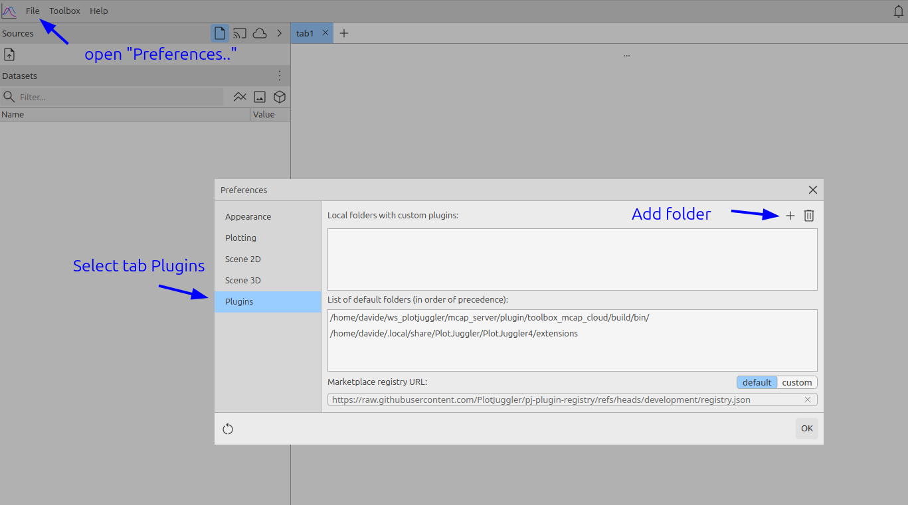
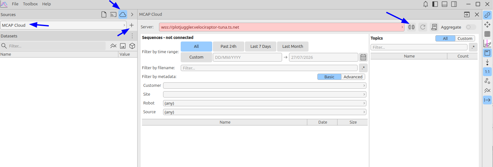
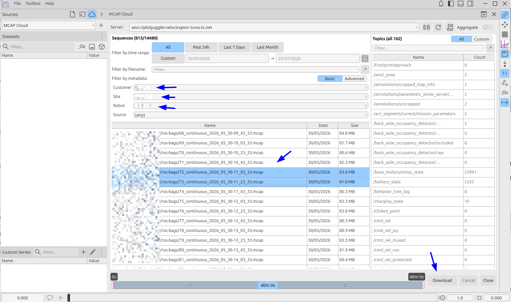

# How to use the MCAP cloud plugin in PlotJuggler 4

## Download and install the plugin

You can download the latest version of the plugin from 

https://github.com/PlotJuggler/pj-mcap-server/releases

The name of the file should be **toolbox_mcap_cloud-*.zip** (select either the Linux or Windows version).

Unpack the .zip file and then add this directory to `Preferences -> Plugins`

Finally, restart PJ4 to load the plugin.

## Launch the MCAP Cloud connector

In the "Sources" section in the top left panel, select the "Cloud" category.

If the plugin was installed correctly, you should see an option called "MCAP Cloud". 

Push the "+" button to launch the connector.

Specify the websocket URL of the server and press the "connect" button.

Note that on the right side of the connect button, there is also a "Cert / API Key" button that will open a dialog to add your API key, for a secure connection.

## Find the MCAP files you are looking for

The first thing to do once connected is to filter
by Customer / Site / Robot.

Next, you may filter by date range or filename.

Note that you can select adjacent, non-overlapping files and these will be
"merged" into one continuous session.

Press the "Download" button at the bottom right to start downloading the data.

